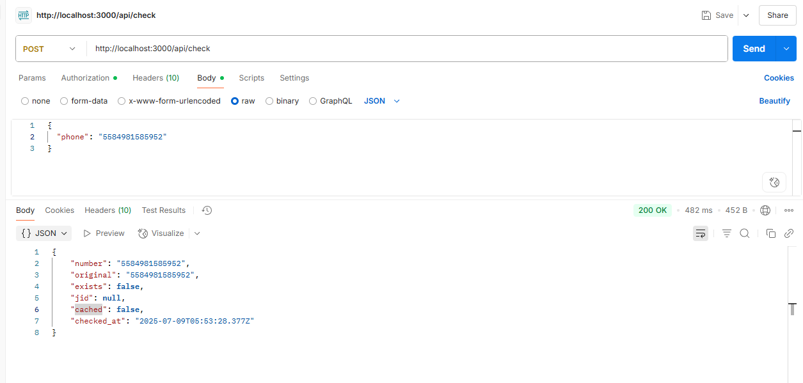

# whatsapp-checker-api

API para verificar se um número possui WhatsApp, usando Baileys.js. Sem necessitar enviar mensagens.

## Como funciona

- Baseada em Node.js + Express;
- Conecta via WhatsApp Web (Baileys);
- Não envia mensagens, apenas consulta se o número está registrado;

#### Clone o repositório instale as dependencias usando ```npm install``` e adicione um arquivo ```.env``` para adicionar os dados de conexão com o banco de dados;
- Feito isso acesse a rota ```/admin``` para acessar e conectar o whatsapp para utilizar a API;

### Doc API
###### Acesse no [postman](https://www.postman.com/juniorsantos-5089914/whatsapp-checker-api/documentation/d7woiuq/whatsapp-checker-api)
- Use as rotas 
#### /api/check
- Verificar se o número tem whatsapp;
- Use ```"force_check": true ``` para forçar a verificação no whatsapp caso tenha cache;


#### /api/status
- Para verificar o status de conexão do whatsapp;

